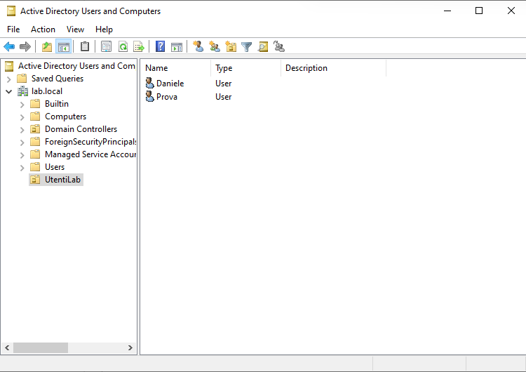
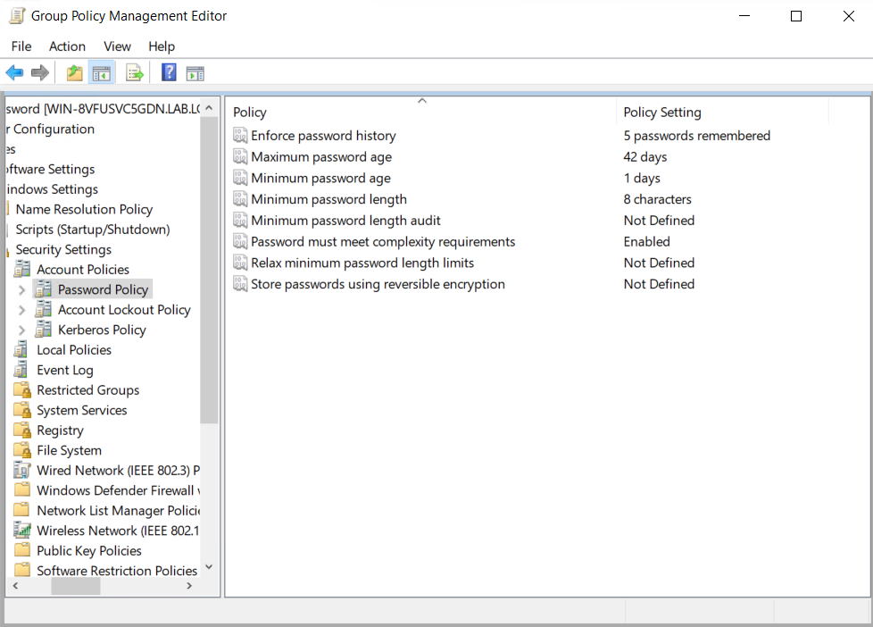
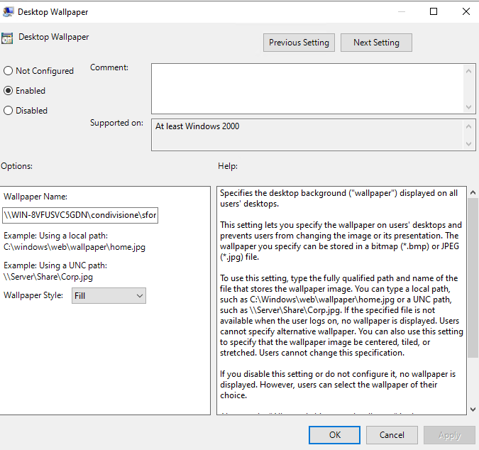

# 🧱 Windows 10 – Domain Join & GPOs (Proxmox Lab)

Complete configuration of a Windows 10 client joined to a Windows Server 2022 domain controller (`lab.local`) in my Proxmox home lab. Group Policies are applied to enforce password security and a desktop wallpaper using Active Directory and a shared folder.

---

## 🖼️ Reference Images

* User Daniele added in Active Directory  
  

* Password policy applied via Default Domain Policy  
  

* Desktop wallpaper applied via GPO  
  

---

## 📚 Language / Lingua

* 🇬🇧 [English version](#-english-version)
* 🇮🇹 [Versione italiana](#-versione-italiana)

---

##  English Version

### 1. Objective

Join a Windows 10 client to the domain `lab.local` and apply:

* Password policy via Group Policy (Default Domain Policy)  
* Desktop wallpaper via a dedicated GPO and shared folder

---

### 2. Requirements

* Windows 10 VM with static IP in same subnet as the Domain Controller  
* Domain Controller configured with AD DS and DNS  
* Shared folder with a wallpaper image (`sfondo.jpg`)

---

### 3. Join Windows 10 Client to Domain

1. Open **System Properties**  
2. Click **Change settings** → **Change...**  
3. Select **Domain**, enter: `lab.local`  
4. Enter credentials: `lab\Administrator`  
5. Reboot the system  
6. Log in as: `lab\Daniele`

---

### 4. Password Policy via GPO

**Path:**  
`Computer Configuration → Policies → Windows Settings → Security Settings → Account Policies → Password Policy`

**Settings applied:**

* Enforce password history: `1 password`  
* Maximum password age: `30 days`  
* Minimum password length: `8 characters`  
* Password must meet complexity requirements: `Enabled`  
* Store password using reversible encryption: `Disabled`

---

### 5. Desktop Wallpaper via GPO

#### 5.1 Shared Folder Setup

1. Create a folder: `C:\Condivisione`  
2. Place `sfondo.jpg` inside  
3. Share path: `\\WIN-8VFUSVC5GDN\condivisione`  
4. Set **share permissions**: `Everyone → Read`  
5. Set **NTFS permissions**: `Authenticated Users → Read`

#### 5.2 Create GPO: "Sfondo Desktop"

**Path:**  
`User Configuration → Policies → Administrative Templates → Desktop → Desktop → Desktop Wallpaper`

**Settings:**

* Enabled: `Yes`  
* Wallpaper name: `\\WIN-8VFUSVC5GDN\condivisione\sfondo.jpg`  
* Wallpaper style: `Fill`

#### 5.3 Apply and Verify
 `gpupdate /force` 
 
 Reboot and check that the wallpaper is applied and locked.

---

### 6. Author

Created by **Sebastiano Daniele Condorelli**

LinkedIn: [linkedin.com/in/sebastianodanielecondorelli](https://www.linkedin.com/in/sebastianodanielecondorelli)

2025

---

## Versione italiana

### 1. Obiettivo

Unire un client Windows 10 al dominio `lab.local` e applicare:

* Criteri password tramite GPO (Default Domain Policy)  
* Sfondo desktop tramite GPO e cartella condivisa

---

### 2. Requisiti

* VM Windows 10 con IP statico sulla stessa rete del Domain Controller  
* Domain Controller configurato con AD DS e DNS  
* Cartella condivisa con immagine `sfondo.jpg`

---

### 3. Join del client al dominio

1. Apri **Proprietà del sistema**  
2. Clic su **Modifica impostazioni** → **Modifica...**  
3. Seleziona **Dominio** e inserisci: `lab.local`  
4. Inserisci le credenziali: `lab\Administrator`  
5. Riavvia il sistema  
6. Accedi con: `lab\Daniele`

---

### 4. Criteri password via GPO

**Percorso:**  
`Computer Configuration → Policies → Windows Settings → Security Settings → Account Policies → Password Policy`

**Impostazioni applicate:**

* Storico password: `1 password`  
* Scadenza password: `30 giorni`  
* Lunghezza minima: `8 caratteri`  
* Complessità: `Abilitata`  
* Crittografia reversibile: `Disabilitata`

---

### 5. Sfondo desktop via GPO

#### 5.1 Cartella condivisa

1. Crea cartella: `C:\Condivisione`  
2. Inserisci immagine: `sfondo.jpg`  
3. Condividi come: `\\WIN-8VFUSVC5GDN\condivisione`  
4. **Permessi condivisione**: `Everyone → Lettura`  
5. **Permessi NTFS**: `Authenticated Users → Lettura`

#### 5.2 Crea GPO: "Sfondo Desktop"

**Percorso:**  
`User Configuration → Policies → Administrative Templates → Desktop → Desktop → Desktop Wallpaper`

**Impostazioni:**

* Abilitato: `Sì`  
* Percorso immagine: `\\WIN-8VFUSVC5GDN\condivisione\sfondo.jpg`  
* Stile: `Riempi (Fill)`

#### 5.3 Applica e verifica
 `gpupdate /force` 

Riavvia il sistema e verifica che lo sfondo sia stato applicato correttamente.

---

### 6. Autore

Creato da **Sebastiano Daniele Condorelli**

LinkedIn: [linkedin.com/in/sebastianodanielecondorelli](https://www.linkedin.com/in/sebastianodanielecondorelli)

2025
